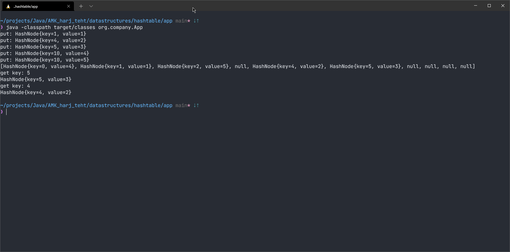

# Hashtable



## Avaimen lisääminen ja yhteentörmäysten hallinta
```
    public void put(HashNode node) {
        System.out.println("put: " + node);
        int hashedKey = hashKey(node.getKey());
        if (occupied(hashedKey)) {
            int stopIndex = hashedKey;
            if (hashedKey == hashtable.length - 1) {
                hashedKey = 0;
            } else {
                hashedKey++;
            }

            while (occupied(hashedKey) && hashedKey != stopIndex) {
                hashedKey = (hashedKey + 1) % hashtable.length;
            }
        }

        if (!occupied(hashedKey)) {
            node.setKey(hashedKey);
            hashtable[hashedKey] = node;
        }
    }
```

## Avaimen hakeminen
```
    public HashNode get(int key) {
        System.out.println("get key: " + key);
        int hashedKey = hashKey(key);
        return hashtable[hashedKey];
    }
```