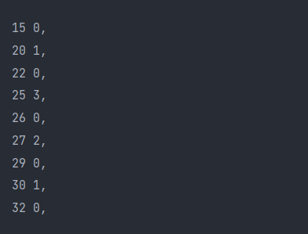

# Binääripuu korkeusilmaisimet
Toteutuksessa käytetty binääripuu:
```
	  25            3
       /      \
1      20       27      2
     /  \     /  \
0    15  22   26  30    1
                /  \
               29  32
```

