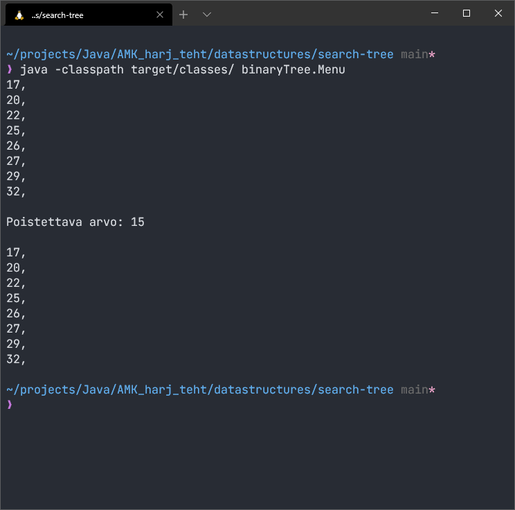
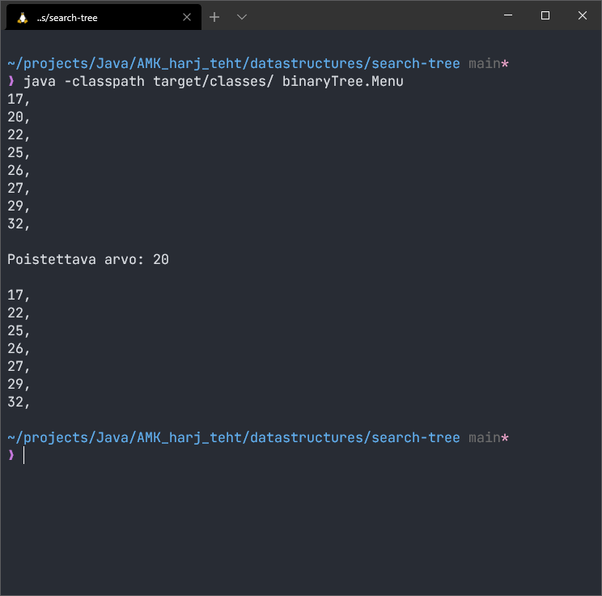

# Binääripuu
Toteutuksessa käytetty binääripuu:
```
	  25
       /      \
      20       27
     /  \     /  \
    15  22   26  30
      \         /  \
       17      29  32
```

## Poistetaan arvo 15

## Poistetaan arvo 17 

## Poistetaan arvo 20 

